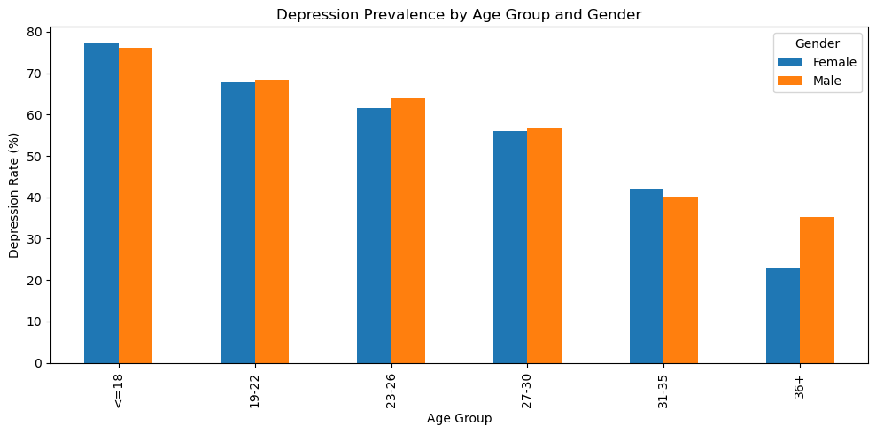
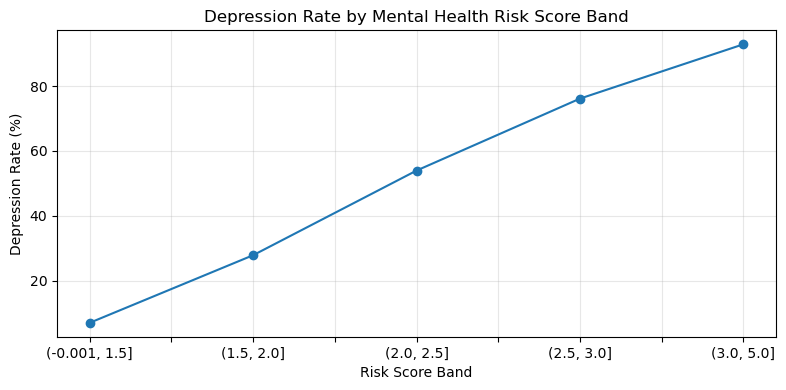
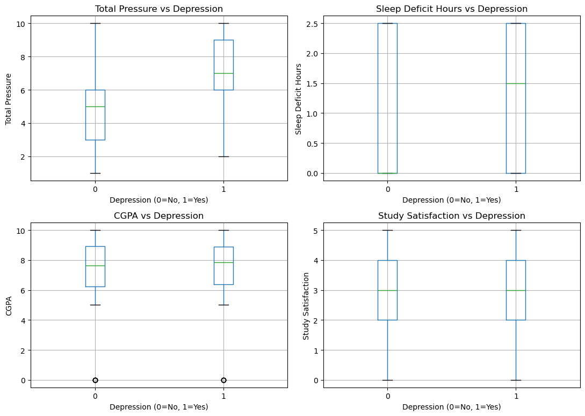
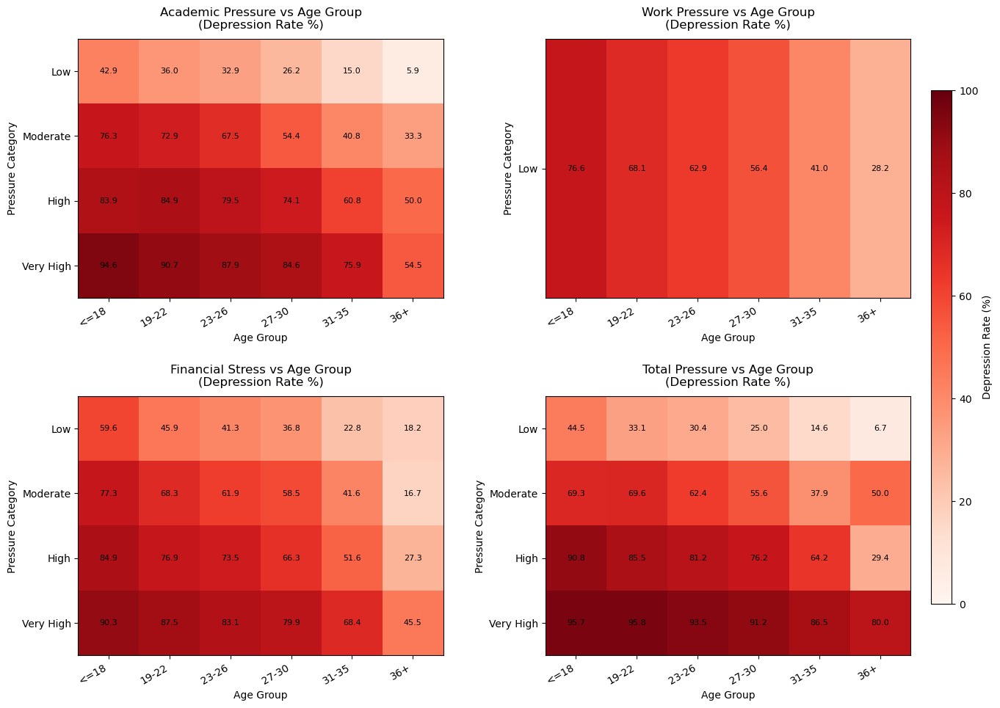
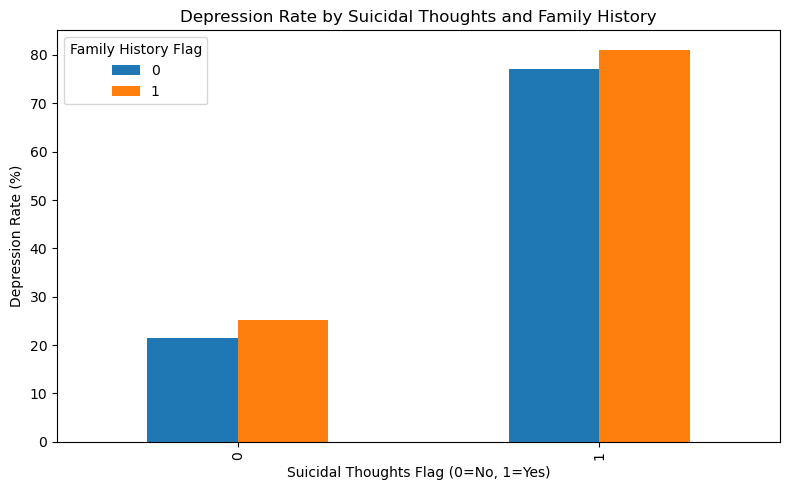
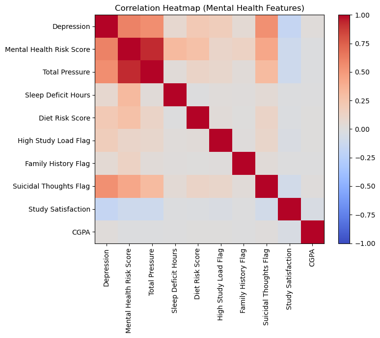

# Student Depression Analysis 

## Project Overview
A comprehensive exploratory data analysis (EDA) and feature engineering study to understand the leading factors influencing depression among students. By utilizing the `Student Depression Dataset.csv`, we've extracted clear patterns to answer critical questions regarding sleep deprivation, academic & financial pressures, and demographic trends.

## Step-by-Step Workflow & Decisions

### 1. Data Cleaning
- **Handling Missing Values:** Text columns with missing placeholders (like "na", "n/a", "none") were converted to true `NaN` values to prevent false string processing.
- **Handling Nulls for Specific Features:**
  - Upon evaluating `Financial Stress`, exactly 3 rows contained `NaN`. 
  - **Decision:** Instead of filling them with median or mean, all 3 rows were dropped. Why? 3 rows out of 27,901 represents less than 0.01% of the data. Dropping them avoids introducing artificial noise via imputation into a highly sensitive feature score.
- **Data Standardization:** Stripping trailing/leading whitespaces from object columns and applying string Title capitalization for nominal data (`Gender`, `Suicidal thoughts`, etc.) ensures consistency in the aggregations.

### 2. Feature Engineering Logic
Raw textual survey data isn't ideal for aggregations or predictive modeling. The notebook implements robust feature engineering:

1. **`Suicidal Thoughts Flag` & `Family History Flag`**: Converted from textual `Yes`/`No` to binary `1`/`0`. This simple conversion makes boolean mathematical operations and correlation mappings significantly easier.
2. **`Age Group`**: Binned the students into distinct age groups (`<=18`, `19-22`, etc.). People of the same bracket often display similar socio-economic pressures. Clustering them helps in identifying widespread generational trends compared to a continuous distribution.
3. **`Sleep Deficit Hours` & `Optimal Sleep Flag`**: 
   - Sleep duration text (e.g., "5-6 hours") was converted to scalar values (`5.5`). 
   - We subtracted this from a baseline of `7` hours to measure **Sleep Deficit**. 
   - Why? Quantifying exact hours lacking has much stronger predictive value than raw text strings. The `Optimal Sleep Flag` indicates if the student hit the healthy 7-9 hours baseline.
4. **`Diet Risk Score`**: Mapped `Healthy`/`Moderate`/`Unhealthy` to integers `0`/`1`/`2` to easily represent the diet effect.
5. **`Total Pressure`**: Straightforward additive feature combining `Academic Pressure`, `Work Pressure`, and `Financial Stress`. This reflects the *cumulative* psychological burden on the individual.
6. **`Mental Health Risk Score`**: An engineered weighted score taking all the above constraints (Pressures: 0.30, Sleep Deficit: 0.20, Diet: 0.15, Suicidal thoughts: 0.20, Family History: 0.15) to produce an overall risk diagnostic per user.

## Data Visualization & Extracted Insights

Here are all extracted Python Matplotlib visualizations mapping out key insights:

### 1. Depression Prevalence by Age Group and Gender

**Insight:** Depression rates steadily increase with age, pivoting significantly in the early 30s age brackets (`31-35`). Both male and female brackets experience high susceptibility over time, emphasizing that depression is largely a widespread progression.

### 2. Mental Health Risk Score Impact

**Insight:** Our engineered `Mental Health Risk Score` feature proves to be an incredibly strong indicator. Once a student's risk profile passes the `2.0` threshold, the frequency of predicted depression steeply spikes from 0% to a near 100% certainty, establishing a clean decision curve.

### 3. Key Numeric Factors vs. Depression 

**Insight:** 
- **Total Pressure:** Students experiencing depression (1) have consistently higher median `Total Pressure` compared to those without.
- **Sleep Deficit Hours:** A notable median jump exists in sleep deficit. Students with higher depressive outcomes tend to lack heavily in foundational sleep cycles.
- Study satisfaction and CGPA show moderately balanced ranges, indicating cumulative stress and sleep heavily eclipse pure academic grades as mental health drivers.

### 4. Pressure vs Age Group Matrix

**Insight:** This comprehensive heatmap block highlights that **Financial Stress** in the "High" to "Very High" buckets strongly propagates depression at massive percentage rates, especially in later age brackets (`27-30` and `31-35`). While `Academic Pressure` distributes more evenly, the compounding nature heavily impacts those already facing high workloads.

### 5. Suicidal Thoughts & Family History Interaction

**Insight:** There is a distinct compounding effect in clinical outcomes. Students holding a positive `Suicidal Thoughts Flag` combined with a `Family History Flag` experience dramatically escalated levels of clinical depression, showing strong biological vs environmental interplay.

### 6. Correlation Heatmap

**Insight:** Solid correlation patterns confirm the `Mental Health Risk Score` strongly correlates with the actual `Depression` parameter. Factors like total sleep deficit and combined stress exhibit much higher associations to mental breakdown than singular raw variables.

## Conclusion 
Demographics spanning their late 20s and early 30s uniformly report greater baseline depression. Sleep deficit and combined financial/academic pressures overwhelmingly drive these negative mental health outcomes across all genders. Focusing on physical wellness boundaries (structured sleep cycles) and broad financial relief offers much greater predictive mental health mitigation than evaluating purely academic variables.
