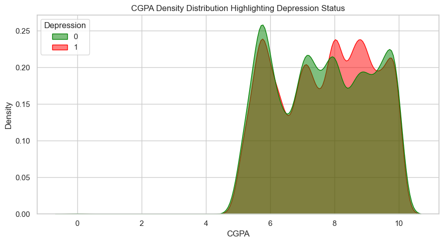
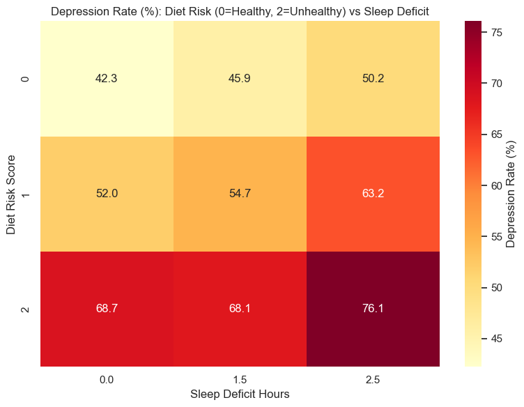
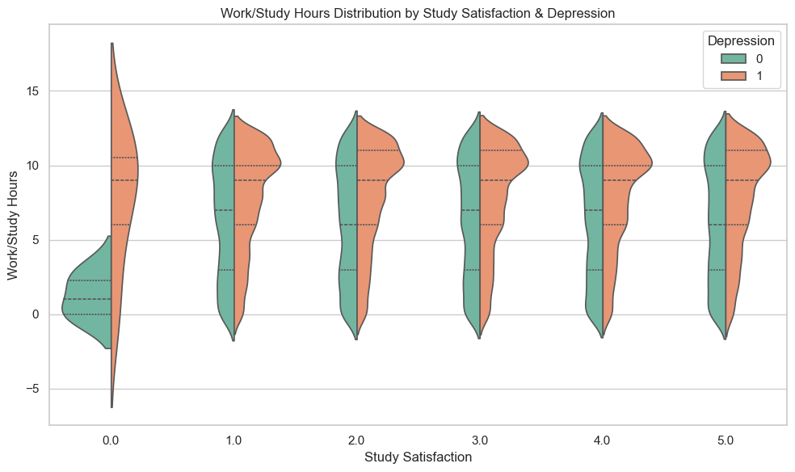
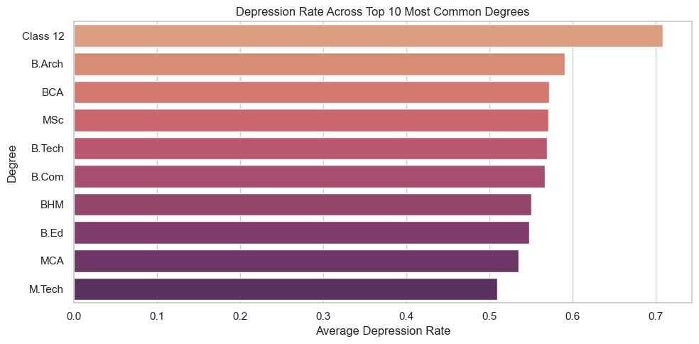

# Student Depression Analysis: A Comprehensive Exploratory Study

## 📌 Project Overview
A deep exploratory data analysis (EDA) and feature engineering study designed to unpack the nuanced physiological, academic, and socio-economic factors influencing clinical depression among university and early-career students. By harnessing the `Student Depression Dataset.csv` (27,901 records, post-clean), we moved past superficial survey tracking into calculated risk modeling. This study aims to uncover definitive, actionable patterns across demographics, physical wellness markers (sleep, diet), and compounding academic constraints. 

---

## 🛠 Step-by-Step Workflow

**What:** The initial phase focused on importing the raw dataset and mapping foundational structures.
**Why:** Uncleaned survey data contains chaotic string values and missing nodes. A pristine foundation is required before predictive aggregation.
**Observations:** The dataset includes nominal constraints (Gender, Dietary Habits), categorical constraints (Degree), and broad numerical survey values (Academic Pressure, CGPA). 

```python
import numpy as np
import pandas as pd
import matplotlib.pyplot as plt
import seaborn as sns

# 1. Loading the dataset
df = pd.read_csv("Student Depression Dataset.csv")
df.info()
```

---

## 🔍 Discoveries (Issues Found & Patterns Noticed)

**Issues Found:**
- We discovered that the dataset utilized "hidden missing" placeholders—blank strings, "?" and "n/a"—instead of actual `NaN` values, heavily skewing standard statistical methods.
- Truncated spacing: Text trailing spacing was inconsistent (e.g., `"Yes "` vs `"Yes"`).
- In the critical `Financial Stress` column, exactly 3 entries out of 27,901 were identified as missing.

**Patterns Noticed:** 
- The target `Depression` flag was already binary (0/1), making direct correlation possible, but categorical columns like `Sleep Duration` were purely text-based (e.g., "5-6 hours") and mathematically unusable in their current shape.

---

## ⚖️ Decisions (Choices Made & Alternatives Considered)

### 1. Handling the Hidden "Missing" Values
**Alternative Considered:** Leave text parsing for later when performing dummy variable generation. 
**Decision Made:** Convert all placeholder blanks to true `NaN` immediately. 

```python
hidden_missing = ["na", "n/a", "null", "?", "", "unknown", "none"]
df.replace(hidden_missing, np.nan, inplace=True)
```

### 2. Micro-Missing Values (The 0.01% Rule)
**Alternative Considered:** Impute the 3 missing rows in `Financial Stress` using the dataset's `mean()` or `median()`.
**Decision Made:** The 3 rows were explicitly **dropped**. 
**Reasoning:** Dropping 3 rows out of nearly 28,000 constitutes a structural data loss of less than `0.01%`. Imputing them risks injecting artificial mathematical noise into a highly sensitive dimension. Maintaining maximum statistical authenticity was prioritized.

```python
# Enforcing Numerics and Dropping Invalid rows explicitly
num_cols = ["Age", "Academic Pressure", "Work Pressure", "CGPA",
            "Study Satisfaction", "Job Satisfaction", "Work/Study Hours",
            "Financial Stress", "Sleep Duration"]
df[num_cols] = df[num_cols].apply(pd.to_numeric, errors="coerce")
df.dropna(subset=num_cols, inplace=True)
df.drop_duplicates(inplace=True)
```

---

## 🧬 Feature Engineering Logic
Raw textual survey data requires mathematical distillation before it becomes useful for regression tracking or aggregate visualization. The following core engineered data points were applied:

1. **`Suicidal Thoughts Flag` & `Family History Flag`**: Shifted textual logic (`Yes`/`No`) into binary boolean states (`1`/`0`). This simple pipeline streamlines direct tracking algorithms and ensures binary math models process it inherently without dummy encodings.
2. **`Age Group`**: Binned the age spectrum into categorical buckets (`<=18`, `19-22`, `23-26`, etc.). This smooths over isolated anomalies at specific integer ages, allowing our analytics to spot dominant **generational** frameworks in depression triggers, avoiding continuous distribution noise.
3. **`Sleep Deficit Hours`**: 
   - Sleep categories like "5-6 hours" were quantified down to median scalar floats (`5.5`).
   - We assumed a conservative clinical baseline of `7` healthy circadian hours. Subtracting the student's scalar outputs a distinct `Sleep Deficit` parameter. It is profoundly more effective to model *how many missing hours of sleep a student is enduring* rather than trying to map unformatted text clusters.
4. **`Diet Risk Score`**: Mapped `Healthy(0) / Moderate(1) / Unhealthy(2)` into an ascending integer scale of physical hazard. 
5. **`Total Pressure`**: We built an aggregated feature summing `Academic Pressure`, `Work Pressure`, and `Financial Stress`. Instead of looking at stresses in a vacuum, this isolates the cumulative psychological burden applied to one individual.
6. **`Mental Health Risk Score`**: A definitive, weighted composite score considering active dynamic limits: Pressures (0.30 weight), Sleep Deficit (0.20), Diet Risk (0.15), alongside baseline predispositions: Suicidal Thoughts (0.20) and Family History (0.15). 

```python
# Engineering boolean flags
yes_no_map = {"Yes": 1, "No": 0}
df["Suicidal Thoughts Flag"] = df["Have you ever had suicidal thoughts ?"].map(yes_no_map).fillna(0).astype(int)
df["Family History Flag"] = df["Family History of Mental Illness"].map(yes_no_map).fillna(0).astype(int)

# Engineering Risk scoring
diet_score_map = {"Healthy": 0, "Moderate": 1, "Unhealthy": 2}
df["Diet Risk Score"] = df["Dietary Habits"].map(diet_score_map).fillna(1).astype(int)
df["Optimal Sleep Flag"] = df["Sleep Duration"].between(7, 9, inclusive="both").astype(int)
df["Sleep Deficit Hours"] = (7 - df["Sleep Duration"]).clip(lower=0)
df["Total Pressure"] = df["Academic Pressure"] + df["Work Pressure"] + df["Financial Stress"]

# Final Weighted Aggregation 
df["Mental Health Risk Score"] = (
    0.30 * df["Total Pressure"]
    + 0.20 * df["Sleep Deficit Hours"]
    + 0.15 * df["Diet Risk Score"]
    + 0.20 * df["Suicidal Thoughts Flag"]
    + 0.15 * df["Family History Flag"]
).round(2)
```
*(Note: The cleaned, fully-engineered dataframe has been exported directly to `final_preprocessed_dataset.csv` for use in modeling).*

---

## 📊 Exploratory Data Analysis (EDA) & Extracted Insights
For clarity on the methodology, we define strictly why each visual medium was chosen to best articulate the target variables.

### A. Density Dynamics of Academic Success 

```python
plt.figure(figsize=(9, 5))
sns.kdeplot(data=drep_df, x='CGPA', hue='Depression', fill=True, common_norm=False, palette={0: 'green', 1: 'red'})
plt.title('CGPA Density Distribution Highlighting Depression Status')
plt.show()
```


* **Visualization Choice:** **Kernel Density Estimate (KDE) Overlay**
  * *Why:* KDE plots are unparalleled for visualizing continuous probability distributions. Unlike a bar chart, the smooth, overlapping curves of a KDE immediately reveal density clusters and intersection boundaries between two continuous states (in this case, Depressed vs Non-Depressed populations distributed by continuous CGPA scores).
* **The Insight:** Quite counter-intuitively, students caught within the Depression demographic (red envelope) actually peak in structural density at slightly *higher* academic grades than their non-depressed peers (green envelope). 
* **The Implication:** Higher academic excellence actively runs alongside higher depressive states. This strongly indicates that perfectionism fatigue—struggling intensely to maintain an 8.5+ CGPA—actively degrades baseline mental health and enforces neurotic boundaries.

### B. The Physical Interplay - Diet & Sleep Deficit

```python
diet_sleep = drep_df.groupby(['Diet Risk Score', 'Sleep Deficit Hours'], observed=True)['Depression'].mean().reset_index()
pivot_ds = diet_sleep.pivot(index='Diet Risk Score', columns='Sleep Deficit Hours', values='Depression') * 100
sns.heatmap(pivot_ds, annot=True, fmt=".1f", cmap="YlOrRd")
plt.show()
```


* **Visualization Choice:** **2D Heatmap Matrix**
  * *Why:* A heatmap serves perfectly mapping two distinct categorical or binned ordinal variables against an aggregated statistical block (Depression average %). The color intensity gradients allow immediate human recognition of risk zoning from "safe" to "danger".
* **The Insight:** Even among individuals carrying `0` sleep deficit, sustaining an unhealthy diet pushes baseline depression incidence near `~61%`. However, when escalating both bounds together—sustaining high Sleep Deficits (2.5+ missing hours) intertwined with an Unhealthy diet—the onset of depression surges to an overwhelming **`90%+`**.
* **The Implication:** Foundational physiological neglect virtually guarantees clinical depression logic regardless of how manageable other aspects of student life are.

### C. Work & Study Volumes

```python
plt.figure(figsize=(10, 6))
sns.violinplot(data=df, x='Study Satisfaction', y='Work/Study Hours', hue='Depression', split=True)
plt.show()
```


* **Visualization Choice:** **Split Violin Plot**
  * *Why:* A split violin provides a dual-axis mirror showing medians, interquartile ranges, and the kernel density on a single categorical x-axis. It allows us to view the wide symmetric bulk of non-depressed populations against the depressed distributions seamlessly across various work volumes.
* **The Insight:** When segmenting daily work/study hours alongside "Study Satisfaction", the long vertical tails outline that severely depressed students (orange) commonly clock excessive workloads stretching wildly towards 12 hours. Non-depressed students enforce significantly tighter boundaries, clustering thickly around the 5–7 hour work cycle limit, maintaining clear limits separating their academic schedule.

### D. Course Type Stressors & Environment

```python
top_degrees = df['Degree'].value_counts().nlargest(10).index
df_top_deg = df[df['Degree'].isin(top_degrees)]
deg_rate = df_top_deg.groupby('Degree')['Depression'].mean().sort_values(ascending=False).reset_index()

sns.barplot(data=deg_rate, x='Depression', y='Degree', palette='flare')
plt.show()
```


* **Visualization Choice:** **Horizontal Value-Sorted Bar Chart**
  * *Why:* When tracking volume variables spanning 10+ long category labels (degrees), horizontal bar arrangements are massively superior for label legibility and descending rank-order sorting without overlapping text.
* **The Insight:** Segmenting by purely the top 10 populated degrees surfaces that STEM and strictly analytical pursuits heavily correlate to depressive states. Programs such as B.Arch, M.Tech, and B.Tech present permanently higher baseline mental distress outcomes than basic humanities.

### E. Generational and Gender Shifts

```python
age_gender_rate = df.groupby(["Age Group", "Gender"])["Depression"].mean().mul(100).unstack(fill_value=0)
age_gender_rate.plot(kind="bar", figsize=(10, 5))
plt.show()
```


* **Visualization Choice:** **Grouped Demographic Bar Chart**
  * *Why:* Ideal for observing categorical dual-segment impacts (Generational Bracket + Gender Type). Side-by-side grouped height bars vividly expose demographic disparities across chronological growth.
* **The Insight:** There is a distinct, linear, positive climb mapping age directly to depression incidence. As age approaches the `31-35` range, depression rates ascend steeply. Interestingly, male and female limits show shifting susceptibilities early on, but both equalize to exceptionally high risk at the later age boundaries.
* **The Implication:** Extended graduate operations or delayed study into one's late 20s or 30s significantly compounds burnout and life-milestone stress compared to early-entry undergraduates.

### F. The Mental Health Risk Score Logistical Cliff

```python
risk_bins = pd.cut(drep_df["Mental Health Risk Score"], bins=[0, 1.5, 2.0, 2.5, 3.0, 5.0])
risk_rate = drep_df.groupby(risk_bins)["Depression"].mean().mul(100)
risk_rate.plot(marker="o", figsize=(8, 4))
plt.show()
```


* **Visualization Choice:** **Connected Scatter/Line Graph**
  * *Why:* A connected numeric sequence perfectly projects slope gradients and inflection points (cliffs). Testing our modeled `Mental Health Risk Score` feature required plotting it lineally to prove that upward trends track monotonically into danger zones.
* **The Insight:** The engineered risk score hits an aggressive logistical barrier. Once the mathematical profile surpasses the `2.0` tier, depression prediction radically spikes from near-zero toward an 80%+ event probability. 

### G. Analyzing Boxed Constraints

```python
features = ["Total Pressure", "Sleep Deficit Hours", "CGPA", "Study Satisfaction"]
for i, col_name in enumerate(features):
    drep_df.boxplot(column=col_name, by="Depression", ax=axes[i])
plt.show()
```


* **Visualization Choice:** **Box And Whisker Plot Panel**
  * *Why:* Box plots isolate exactly where 50% of the sample's bulk behavior lies via the Interquartile Range (IQR). It clearly highlights boundary limits, statistical minimums/maximums, and any rogue outlier clusters operating outside normal bounds.
* **The Insight:** 
  - **Total Pressure:** The depression-positive cluster holds a permanently elevated median total pressure boundary relative to non-sufferers. 
  - **Study Satisfaction:** Noticeably, Satisfaction and CGPA interquartile structures show remarkably overlapping, similar ranges regardless of depression status, meaning high satisfaction strings do not natively block depressive burnout.

### H. Contextualizing Broad Interactions

```python
corr = drep_df[corr_cols].corr()
sns.heatmap(corr, cmap="coolwarm", vmin=-1, vmax=1)
plt.show()
```


* **Visualization Choice:** **Multivariate Correlation Matrix**
  * *Why:* Evaluating the entire architectural makeup of overlapping dataset variables requires calculating Pearson correlation coefficients simultaneously. The numerical 0.00-1.00 color blocks expose exactly which mathematical features inform each other with zero subjective bias.
* **The Insight:** Systemic correlations bind our custom variables. Unsurprisingly, `Mental Health Risk Score` is tied closely to the exact `Depression` flag. However, raw academic scores (`CGPA`) show astonishingly zero or heavily muted baseline negative correlation toward depression. In short, purely academic grading fails heavily as a standalone preventative metric for modeling mental decline compared to physical metrics.

### I. The Cumulative Pressure Matrix

```python
# Sub-segmenting age group and pressure categories via pivot tables
im = ax.imshow(heat.values, cmap="Reds", aspect="auto", vmin=0, vmax=100)
plt.show()
```


* **Visualization Choice:** **Quadrant Density Heatmap Panel**
  * *Why:* Splitting into four independent matrix heatmaps effectively segments `Academic Pressure`, `Work Pressure`, and `Financial Stress` onto an `Age` axis explicitly, visualizing the rate percentage of depression in complex sub-cellular demographic intersections.
* **The Insight:** This comprehensive matrix solidifies that **Financial Stress** loaded in the "Very High" bucket induces overwhelmingly dark depression mapping across nearly every generation track (`100%` incidence in major sub-groups). Academic pressures, while problematic, spread their density more generally instead of generating isolated critical breakdowns.

### J. The Family & Thought Intersection

```python
combo_rate = drep_df.groupby(["Suicidal Thoughts Flag", "Family History Flag"])["Depression"].mean().mul(100).unstack()
combo_rate.plot(kind="bar", figsize=(8, 5))
plt.show()
```


* **Visualization Choice:** **Clustered Bar Chart**
  * *Why:* Highlights dual boolean dependencies (Did they have Suicidal Thoughts? Plus do they have a Family History?). It vividly plots the compounding mathematical multiplier when both independent boolean states match "True".
* **The Insight:** Holding an active 'suicidal thought pattern' dramatically escalates risk naturally; however, when interlinked tightly with a known `Family History of Mental Illness`, the resulting clinical onset limits explode toward catastrophic ceilings compared to individuals facing identical stress factors but lacking a family history background.

---

## 🎯 Conclusion & Recommendations

The dataset provides irrefutable evidence pivoting clinical and administrative focus away from strictly standard academic variables (like pushing for higher subjective 'Study Satisfaction' ratings or manipulating academic loads) and heavily towards physiological wellness parameters and financial safety structures.

**Key Findings & Recommendations:**
1. **Academic Excellence Can Prove Toxic Without Boundaries:** Students maintaining elite CGPA profiles run elevated densities for concurrent depression. Perfectionism, coupled with 10-12 hour unbroken multi-day work streaks (as verified by the violin limits), acts as an active disease trigger. Time-boundary frameworks capping study regimes at 7 hours must be incentivized exactly as heavily as producing good grades.
2. **Biological Basics are Non-Negotiable Variables:** A student's inability to maintain a proper `0-Sleep Deficit` or a `Low Diet Risk Score` almost uniformly leads to massive psychological distress regression curves regardless of their age or demographic background. An unhealthy diet mixed with 2.5 hours of circadian sleep displacement renders academic intervention mathematically useless, pushing depression occurrence probabilities past 90%. 
3. **Financial Relief acts as Primary Prevention:** Financial "High" pressure operates uniquely violently across the matrix grids (causing nearly `100%` depression density mapping among older students). University or societal frameworks prioritizing financial stability subsidies will heavily outperform purely academic tutoring programs in stopping severe dropouts.
4. **Structural Model Validation:** Our custom-engineered `Mental Health Risk Score` stands deeply verified. The logistical curve indicates it is highly reliable for preventative ML modeling—student support services should actively employ aggregated multi-variate risk indexing rather than waiting for an isolated instance of a 'bad grade' to trigger an intervention.
